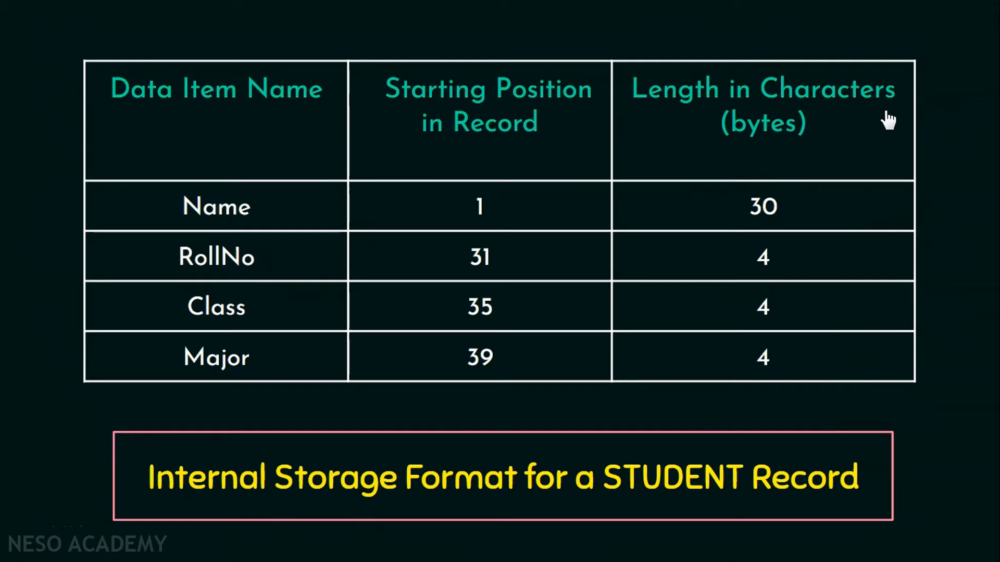
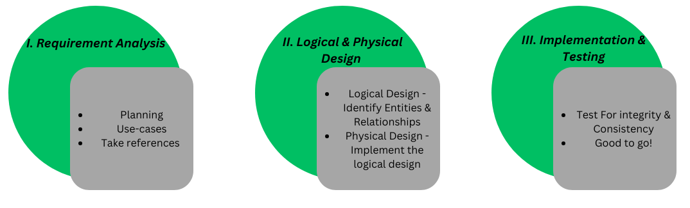

Data is raw or unprocessed facts that you can record. Ex: Any number, name of person, name of place, image, audio, video, etc 
The processed data that gives meaningful context is called Information. Ex: The age of Suresh is 25. 
Database is a collection of **related** data. Ex: Online banking system, library management system 
The database deifinition is called Meta-data. It is complete description of database. Ex: Type of data, Constraints, etc
DBMS is collection of programs that enables users to create and maintain the database. 

## What is Database? 
A database is a collection of interrelated data that helps in the efficient retrieval, insertion, and deletion of data from the database and organizes the data in the form of tables, views, schemas, reports, etc. For Example, a university database organizes the data about students, faculty, admin staff, etc. which helps in the efficient retrieval, insertion, and deletion of data from it.

## What is DBMS?
A Database Management System (DBMS) is a software system that is designed to manage and organize data in a structured manner. It allows users to create, modify, and query a database, as well as manage the security and access controls for that database. DBMS provides an environment to store and retrieve data in convenient and efficient manner.

### Functionalities of DBMS 
- Define: Specifying the **data type, structures and constraints** for the data to be stored. For age we can have constraints like it should be between 1-100. 
- Construct: Process of **storing data** on some storage medium
- Manipulate: Querying the database to retrieve specific data, updating database and generating reports. 
- Share: Allows multiple users and programs to **access** the dabase **concurrently**
- Protection of database from unauthorized access or hardware/software failure
- Maintainence of database for long period of time. 

### Properties of Database 
1. Adatabase represents some aspects of the real world. Objects,their properties and the relationships between them all is represented by a database and if there is any change in the real world that change will also be reflected in the database 
2. A database is a **logically coherent** collection of data with some inherent meaning. A random collection of data or unrelated data cannot be referred to as a database. The data in the database has to be related or logically coherent.
3. A database is designed and then built and populated with data for a specific purpose. 

### Illustration of database system environment 
 The users or the programmer who writes queries or programs and these queries or programs are processed by the DBMS software and then based on the processed queries DBMS software accesses the stored data in the database. It accesses the stored database as well as the metadata. The metadata is the database definition. 

## DBMS Characteristics  
1. Self-describing nature of a database system 
2. Insulation between programs and data and data abstraction 
3. Support of multiple views of the data 
4. Sharing of data and multi-user transaction processing 

**1. Self-describing nature of a database system**
A database system not only consists of a database but it also contains the metadata. Metadata is the database definition or a complete description of the database. Information like the data type and the constraints, all these information is what we call as metadata and this information is stored in the DBMS catalog and this catalog is used by the DBMS software as well as it is used by the database users who wants to know what the structure of the database 
- DBMS software must work equally well with any number of database applications. We can have any number of database applications like for example a university database, a library database or a banking database. As long as the database definition or the metadata is stored in the catalog, DBMS software has to work efficiently or equally well with any number of database applications whereas in the traditional file processing data definition or metadata in DBMS is part of the application programs itself. So they work with only one specific database application because the structure is declared in the program itself. Unlike DBMS they cannot work with more than one database application. 

**2. Insulation between programs and data and data abstraction **
 - In traditional file processing, the structure of data files is embedded in the application programs itself. The structure is within the program. If there is any change to the structure of data files, it is going to affect the programs.  we also need to change the application program 
 - Whereas in the database approach the structure of data files is stored in the DBMS catalog and it is separate from the access programs. Since the structure is stored separately from the programs so if there is any change brought to the structure of the data files it does not affect the programs and that is called as **program data independence**

In the  university database we had a student table. The internal storage format for that student record has Data Item Name or the column name,  Starting Position  in Record and the Length in characters 

In traditional file systems this structure is present within the programs itself. If I want to add another piece of data say date of birth, since the structure is changed this program will not work and the program has to be changed whereas in the database approach if you want to add a new piece of data without affecting the programs. Since the structure is separate from the programs, we don't have to change the programs. we just have to add this new information in the catalog. Next time a DBMS program refers to the catalog, the new structure will be referred and used. It is called as a program data independence 

- The characteristic that allows program-data independence is called data abstraction.
- DBMS provides users with conceptual representation of data. It hides the behind the the complicated details that are not of interest to the database user 
- A data model is a type of data abstraction that provides conceptual representation to the database users in a way that most users can understand and the data model hides the storage and implementation details from the users 

**3. Support of multiple views of the Data**
- A database has many users and each of those users will have different needs or they may require a different view or a different perspective of a database. For example: one user will be only interested to know the grades received by the students while another user will be interested to only know the courses taken by each student. So DBMS will provide only that necessary data that is required for each user. 
- A view which is a subset of database or it is derived from a main database table, contains virtual data or data that is not physically stored or that is not explicitly stored. 

**4.  Sharing of data and multi-user transaction processing**
- A multi-user dbms allows multiple users to access the database at the same time. 
- Now for multiple users to access the database at the same time DBMS has to provide concurrency control. When multiple users are sharing the same database at the same time, it should prevent two users from editing the same data at the same time. Example: we have travel agents or reservation agents and if one of the agents is booking a bus ticket for a particular passenger and if he is assigning a seat for that passenger then that particular seat should get blocked and no other agents should be able to access or book that seat for any other passenger and that is what we call as concurrency control
- The kind of applications that require concurrency control are called as OLTP(Online Transaction Processing) and it is a major part of database application 
- DBMS must enforce or must ensure several transaction properties. The transaction means program under execution. The two different transaction properties are isolation and atomicity 

Isolation: If one agent assigns a seat to a particular passenger then that seat is blocked or it is isolated from other agents. Isolation is one of the transaction properties that DBMS 
Atomicity: DBMS should ensure that the transaction is executed completely or none at all now. When an agent is assigned a seat for a passenger and if the transaction is stuck midway or if it is incomplete then that seat has to be released for other agents to access. Either the transaction should be executed completely or none at all 

# Database Users 
Based on their interaction with the database database users are divided into two 
** 1. Actors on the scene**
Actors on the scene are the people whose jobs involve using large databases every day. Under it we have four types of users 
1 Database administrators 
2. Database designers 
3. End users 
4. System analysts and Application programmers(SE) 

** 2. Workers behind the scene**
Workers behind the scene are the people whose work is to maintain the database system environment. They deal with the design, development and operation of the database system environment and they are not interested in the database itself. Under this we have the three types of users,  
1. The system designers and implementers 
2. The tool developers 
3. The operators and maintenance personnel 

**Database administrators** 
In any large organization we might have many resources and we always need a main person or a manager to manage these resources. Similarly in the database environment we have database as the primary resource and DBMS and its related software as a secondary resource and 
- Administering the primary/secondary resources
- Authorizing access to the database. They can grant any user the permission to access the database 
- Coordinating and monitoring the use of database 
- Acquiring hardware and software resources as needed 
- Troubleshooting if any problem arises or to see if there are any security issues 

# Advantages & Disadvantages of DBMS 
ADVANTAGES OF DBMS APPROACH 
- Controlling Redundancy 
- Restricting unauthorized access 
- Providing persistent storage for program objects 
- Providing storage structures for efficient query processing 
- Providing backup and recovery 
- Providing multiple user interfaces 
- Representing complex relationships among data 
- Enforcing integrity constraints 
- Permitting inferencing and actions using rules 

 **Controlling Redundancy:**  On the traditional file system each user group maintains their own files. Accounts Department(Roll_No, Name, Fees Paid, Fees Due) and Exam Department(Roll_No, Name, Course, Grades). In the traditional approach much of the data will be repeated which leads to problems like wastage of storage space and data inconsistency. The data inconsistency occurs when update is applied to some files and not to others. Ex: Accounts department updates the student name and the same student name is not updated in the exam department then that causes inconsistency whereas in the database approach views of different users are integrated while designing a database and in this approach all the data will be stored in only one place of the database and any number of users can access this repository at the same time. So duplication of data or data redundancy is controlled in the DBMS approach. It ensures data consistency and saves storage space 
 
**Restricting Unauthorized Access:**
DBMS allows multiple users or many users to share a large database but all these users will not have the same type of access permission to the database. Ex:  any confidential data of a company like the finance will be accessible by only a few authorized users.
DBMS must provide security and authorization subsystem which is used by the DBS to create accounts and also specify any restrictions on that account. Parametric users are allowed to access the database only through the canned transactions 

**Providing Persistent Storage for Program Objects**
Based on OOP concept, we have object oriented database systems. In traditional file systems, the values of program variables will be discarded or it will be deleted or erased once the program terminates whereas in the DBMS approach the values of the program variables will not be discarded when the program terminates. They allow the program objects to store permanently and such an object is said to be persistent. 
Iin the traditional approach since the objects will be erased or deleted when the program terminates, we can store the objects explicitly in separate files which are permanent and this involves conversion to a format that is suitable for file storage whereas in the DBMS approach, it recognizes the programming languages and automatically converts any objects in C++ or Java can be stored permanently in an object oriented DBMS. Such objects are said to be persistent since it is not erased or deleted when the program terminates 

**Providing Storage Structures for Efficient Query Processing**
Database systems must provide capabilities to efficiently execute the queries and updates 
Since the database is stored on disk, DBMS has to provide special data structures to speed up the disk search and for this disk search we use **indexes**.
To process a particular query, the database records will be copied from the disk to the main memory. Database buffer allows temporary storage of data in the main memory. A module in DBMS called as the query processing and optimization module is responsible for efficient query execution 

**Providing Backup and Recovery**
A module in DBMS called the backup and recovery subsystem is responsible for recovery from any kind of hardware or software failures. 
Ex: if the computer system crashes during a complex transaction then the recovery subsystem of DBMS is responsible for ensuring that the transaction resumes from where it is interrupted or at least restore the database to the state it was before the transaction started executing.

**Providing Multiple User Interfaces** 
There are different types of database users and all these users have different levels of technical knowledge. So based on that DBMS provides a variety of user interfaces 
Example: Query languages are for the casual users, the programming language interfaces are for the application programmers, the form based user interface are for the parametric users and the menu driven interfaces are for the standalone users 
The form based interfaces and the menu driven interfaces together are called as a Graphical User Interface 

**Representing Complex Relationships among Data**
A database can have variety of data stored in different tables and these data can be interrelated in many ways 
A DBMS must be capable of representing any kind of relationships among these data and also it must be capable of retrieving any kind of related data and updating them easily and efficiently.

**Enforcing Integrity Constraints**
In a database we can have different types of integrity constraints on the data. DBMS should be capable to define these constraints and also enforce them. The simplest type of integrity constraint is specifying the data type for each data item whether it is integer or string of characters etc 
Another type of constraint is the uniqueness of the data item values. Example: The roll numbers of students has to be unique and cannot be repeated 
It is the responsibility of a database designer to identify what type of integrity constraints are required on the data during the database design 

**Permitting Inferencing and Actions Using Rules** 
Database systems must provide capabilities for defining deduction rules for inferencing new information. Database systems define rules and based on those rules it inferences new information. Such database systems are called as deductive database systems. Example we can have rules in a mini world application for determining if the student can write his exam or not. We can keep a rule say only if the attendance of a student is about 70 percent then only he can write his exam. These rules that can be applied and based on those rules some action will be taken 
Active database system is a database that consists of a set of triggers. Based on a condition, an action follows. An active database system provides active rules that automatically initiates actions when certain evens and conditions occur 

### Disadvantages of DBMS 
DBMS might have certain overhead costs and these overhead costs of using DBMS are due to certain reasons. 
High investment that we have to do initially in hardware software and also in training 
There is always an overhead cost for providing security, concurrency control, recovery etc 
More problems can arise if the database designer and the database administrator do not design the database properly 

Instead of using DBMS we can use the regular file system when the database and the applications are very simple and well defined and there are no changes expected. when multiple user access is not required we can use the regular files rather than DBMS 

## Characteristics of DBMS
DBMS stands for Data Base Management System. It is a set of computer programs that are used for the creation and modification of a database. It is a software integrity package. The Data Base Management System also acts as an intermediate between the end user and the Database. It also establishes an environment for multiuser to create, access, and manipulate the data in the Database.

Some well-known characteristics are present in the DBMS (Database Management System). These are explained below.

### 1. Real World Entity
- The reality of DBMS (Database Management System) is one of the most important and easily understandable characteristics. The DBMS (Database Management System) is developed in such a way that it can manage huge business organizations and store their business data with security.
- The Database can store information such as the cost of vegetables, milk, bread, etc. In DBMS (Database Management System), the entities look like real-world entities.
- For example, if we want to create a student database, we need some entity. Any student stores their data.
- In the Database, then, it should be the real-world entity. The most commonly used properties in the student database are name, age, gender, roll number, etc.

### 2. Self-explaining nature
- In DBMS (Database Management System), the Database contains another database, and another database also contains metadata.
- Here the term metadata means data about data.
- For example, in a school database, the total number of rows and the table's name are examples of metadata.
- So the self-explaining nature means the Database explains all the information automatically itself. This is because, in the Database, all the data are stored in a structured format.

### 3. Atomicity of Operations (Transactions)
- Here, atomicity means either the operation should be performed or not performed. i.e., it should complete the operation on 0% or 100%.
- Here DBMS (Database Management System) provides atomicity as a characteristic. This is the most important and useful characteristic of the DBMS (Database Management System). You can completely understand the atomicity with the help of the below example.
- For example, every bank has its own Database, and the Database contains all the information about its customers. Let transaction is the most common atomic operation of the bank. If Sona wants to transfer 1000 rupees to the Archita account, it is possible with the help of the atomicity feature of the Database. If there is a problem in the Archita account, if there is a problem in the atomicity of the Database, then the money will be deducted from the Sona account but not credited to the Archita account.
- The Database has the feature of atomicity then; such transactions have not occurred at all, and if the transaction fails, then the money will automatically return to the sender account.
- Basically, for a successful transaction, the total operation depends on the Database. If the Database works perfectly, the transaction will be successful, and if the Database fails, the whole banking server will be down.

### 4. Concurrent Access without Anomalies
- Here the term anomalies mean multiuser can access the Database and fetch the information without any problem.
- For a better understanding, let's take the example of a bank again. Let Sonu give his ATM card to his sister Archita and tell her to withdraw 5000 from the ATM. At the same time, Sonu transferred 2000 rupees to his brother Monu. At the same time, both operations perform successfully. Initially, Sonu had 10000 rupees in his bank account. After both transactions, i.e., transfer and withdraw, when Sonu checks his bank balance, it shows 3000 rupees. This error-free updation of bank balance is possible with the help of the concurrent feature of the Database.
- Thus here we see that concurrent is a great feature of the Database.

### 5. Stores Any Kind of Structured Data
- The Database has the ability to store the data in a structured format.
- In most of the websites, we see that only student database examples are given for a better understanding, but the important fact is that the Database has the ability to store an unlimited amount of data.
- DBMS has the ability to store any type of data that exists in the real world, and these data are structured way. It is another type of very important characteristic of DBMS.

### 6. Integrity
- Here the term integrity means the data should be correct and consistent in nature. Let's understand this by taking an example.
- Let's say there is a bank named ABC bank, and ABC bank has its own Database for the storage of its customer data. If we try to enter the account details of ABC bank and the account details are not available in the bank, then the Database gives the incorrect output. However, if a customer changes their address but the new address is not updated in the Database, it is called data inconsistency.
- So the data available in the Database should be correct as well as consistent.
- If someone's account has zero balance and later the customer deposits 6000 rupees in his account, if the new account balance is not updated in the Database, it creates a problem for the customer.

### 7. Ease of Access (The DBMS Queries)
- The file and folder system was used to store the data before the DBMS came to the market.
- Searching for the student's name was a very difficult task at that time. This is because every search operation is done manually in the file and folder system. But when DBMS comes into the market, it is very easy to access the Database.
- In DBMS, we can search any kind of stored data by applying a simple search operation query. It is so much faster than manual searching.
- In DBMS, there is a CRUD operation ( here CRUD means Create, Read, Update & Delete) by which we can implement all the types of query in the Database.

### 8. SQL and No-SQL Databases
- There are two types of databases (not DBMS): SQL and No-SQL.
- The SQL databases store the data in the form of Tables, i.e., rows and columns. The No-SQL databases can store data in any form other than a table. For instance: the very popular MongoDB stores the data in the form of JSON (JavaScript Object Notation).
- The availability of SQL and No-SQL databases allows us to choose the method of storing the data as well.
- There should not be any debate between SQL and No-SQL databases. The one that we require for a particular project is better for that project, while the other might be better for some other use.
- This is a characteristic of DBMS because DBMS allows us to perform operations on both kinds of databases. So, we can run queries and operations on SQL as well as No-SQL databases.

### 9. ACID Properties
- The DBMS follows certain properties to maintain consistency in the Database. These properties are usually termed ACID Properties.
- However, we have already talked about some of these properties, but it is very important to mention the ACID properties as a whole.
- ACID stands for Atomicity, Consistency, Isolation, and Durability.
- Atomicity means the transaction should either be 0% or 100% completed, and consistency means that the change in data should be reflected everywhere in a database.
- Isolation means that multiple transactions can occur independently without the interference of some other transactions.
- Durability means that the chances of a successful atomic transaction, i.e., a transaction that has been 100% completed, should reflect in the Database.

### 10. Security
- The Database should be accessible to the users in a limited way.
- The access to make changes to a database by the user should be limited, and the users must not be given complete access to the entire Database.
- Unauthorized users should not be allowed to access the Database.
- Authentication: The DBMS has authentication for various users that directly refers to the limit to which the user can access the Database. Authentication means the process of laughing in of the user only with the rights that he/she has been authorized to. For instance, in any organization, the admin has access to make changes to the Database of the organization as some new employee might have joined the organization or someone might have left it. However, the employees have access only to their personal profiles and can make changes to them only. They cannot access the Database of any other employee or the organization as a whole.

## Database Models in DBMS
In database management systems (DBMS), understanding various database models is crucial for the efficient organization, storage, and retrieval of data. A database model defines the logical structure of a database and determines how data can be stored, organized, and manipulated. This article delves into the intricacies of database models in DBMS, exploring their characteristics, advantages, and use cases

There are several different Database model types, some of them are old, while some of them are new, to cater to the new age requirements. Here is a list of the 7 popular Database models:
1. Hierarchical Model
2. Network Model
3. Entity-relationship Model
4. Relational Model
5. Object-oriented Model
6. NoSQL Model
7. Graph Model

**1. Hierarchical Model**
The hierarchical model organizes data in a tree-like structure, where each record has a single parent and possibly many children, resembling a hierarchy. This model is efficient for representing one-to-many relationships. 

- In this model, a child node will only have a single parent node.
- This model efficiently describes many real-world relationships like the index of a book, etc.
- IBM's Information Management System (IMS) is based on this model.
- Data is organized into a tree-like structure with a one-to-many relationship between two different types of data, for example, one department can have many courses, many teachers, and of course many students. 
- Because it has one-to-many relationships between different types of data so it is easier and fast to fetch the data. But the Hierarchical model is less flexible. And it doesn't support many-to-many relationships.

**Key Features:**
Tree Structure: Data is organized in a parent-child hierarchy.
Efficiency: Fast retrieval of data due to predefined paths.
Use Cases: Ideal for applications like organizational charts and file systems.

**2. Network Model** 
The network model extends the hierarchical model by allowing more complex relationships, including many-to-many relationships. Data is represented using nodes (entities) and edges (relationships).

- The Network Model is an extension of the Hierarchical model.
- In this model, data is organized more like a graph, and allowed to have more than one parent node.
- In the network database model, data is more related as more relationships are established in this database model.
- Also, as the data is more related, hence accessing the data is also easier and fast.
- This database model uses many-to-many data relationships.
- Integrated Data Store (IDS) is based on this database model.
- This was the most widely used database model before Relational Model was introduced.
- The implementation of the Network model is complex, and it's very difficult to maintain it.
- The Network model is difficult to modify also.
- You may want to explore this if you are developing some social networking applications, although the Graph Database model is new and is far better than the Network Database model.

**Key Features:**
Flexibility: Supports complex relationships.
Performance: Efficient for representing real-world scenarios with interconnected data.
Use Cases: Suitable for telecommunications, transport networks, and more.

**3. Entity-relationship Model**
The Entity-Relationship (ER) model provides a high-level graphical representation of data, focusing on entities, attributes, and relationships. It is often used in the conceptual design phase of database development..

- In this database model, relationships are created by dividing objects of interest into entities and their characteristics into attributes.
- Different entities are related using relationships.
- ER Models are defined to represent the relationships in pictorial form to make it easier for different stakeholders to understand.
- This model is good to design a database, which can then be turned into tables in a relational model (explained below).
- Let's take an example, If we have to design a School Database, then the Student will be an entity with attributes name, age, address, etc. As an Address is generally complex, it can be another entity with attributes street, pincode, city, etc, and there will be a relationship between them.
- Relationships can also be of different types. You can learn about ER Diagrams in detail if you want to learn about entities and relationships.

**Key Features:**
Graphical Representation: ER diagrams visually represent data structures.
Simplicity: Easy to understand and design.
Use Cases: Commonly used in the initial stages of database design

**4. Relational Model**
- In this model, data is organized in two-dimensional tables and the relationship is maintained by storing a common field.
- This model was introduced by E.F Codd in 1970, and since then it has been the most widely used database model.
- The basic structure of data in the relational model is tables. All the information related to a particular type is stored in rows of that table.
- Hence, tables are also known as relations in the relational model.
- You can design tables, normalize them to reduce data redundancy, and use Structured Query language or SQL to access data from the tables.
- Some of the most popular databases are based on this database model. For example, Oracle, MySQL, etc.

**5. Object-Oriented Data Model**
The object-oriented data model integrates concepts from object-oriented programming into database management. Data is represented as objects, similar to real-world entities, with attributes and methods.

- In this model, data is stored in the form of objects.
- The behavior of the object-oriented database model is just like object-oriented programming.
- A very popular example of an Object Database management system or ODBMS is MongoDB which is also a NoSQL database.
- This database model is not mature enough as compared to the relational database model.
**Key Features:**
Encapsulation: Combines data and behavior.
Inheritance: Supports inheritance hierarchies.
Use Cases: Ideal for applications requiring complex data representations, such as CAD/CAM systems.

**6. NoSQL Model**
- The NoSQL database model supports an unstructured style of storing data.
- Data is stored as documents.
- The documents look more like JSON strings or Key-value based object representations.
- It provides a flexible schema.
- It does provide features like indexing, relationships between data, etc.
- The support for data querying is limited in the NoSQL database model.
- This database model is well-suited for Big data applications, real-time analytics, CMS (Content Management systems), etc.

**7. Graph Model**
- The Graph database model is based on more real-world like relationships.
- Data is represented using Nodes or entities.
- The nodes are related using edges.
- The popular database Neo4j is based on the Graph database model.
- If your application has simple data requirements, then you should not use the graph database model.
- In modern applications like social networks, recommendation systems, etc. the graph database model is well-suited.

## SQL 

### What is SQL?
Structured query language (SQL) is a programming language for storing and processing information in a relational database. A relational database stores information in tabular form, with rows and columns representing different data attributes and the various relationships between the data values. You can use SQL statements to store, update, remove, search, and retrieve information from the database. You can also use SQL to maintain and optimize database performance.

### SQL statements
SQL statements, or SQL queries, are valid instructions that relational database management systems understand. Software developers build SQL statements by using different SQL language elements. SQL language elements are components such as identifiers, variables, and search conditions that form a correct SQL statement.

For example, the following SQL statement uses a SQL INSERT command to store Mattress Brand A, priced $499, into a table named Mattress_table, with column names brand_name and cost:
`INSERT INTO Mattress_table (brand_name, cost) VALUES(‘A’,’499’);`

### Stored procedures
Stored procedures are a collection of one or more SQL statements stored in the relational database. Software developers use stored procedures to improve efficiency and performance. For example, they can create a stored procedure for updating sales tables instead of writing the same SQL statement in different applications. 

### What are SQL commands?
Structured query language (SQL) commands are specific keywords or SQL statements that developers use to manipulate the data stored in a relational database. You can categorize SQL commands as follows.

**Data definition language**
Data definition language (DDL) refers to SQL commands that design the database structure. Database engineers use DDL to create and modify database objects based on the business requirements. For example, the database engineer uses the CREATE command to create database objects such as tables, views, and indexes.

**Data query language**
Data query language (DQL) consists of instructions for retrieving data stored in relational databases. Software applications use the SELECT command to filter and return specific results from a SQL table. 

**Data manipulation language**
Data manipulation language (DML) statements write new information or modify existing records in a relational database. For example, an application uses the INSERT command to store a new record in the database.

**Data control language**
Database administrators use data control language (DCL) to manage or authorize database access for other users. For example, they can use the GRANT command to permit certain applications to manipulate one or more tables. 

**Transaction control language**
The relational engine uses transaction control language (TCL) to automatically make database changes. For example, the database uses the ROLLBACK command to undo an erroneous transaction. 

## Database Design in Database Management System
- Database design provides a means to represent real world entities in a form that can be processed by the  computer. Database models present a process of abstracting real world entities into computer representations. 
- To develop a good design, one has to understand the meaning of information and the intended use of  stored representation within the computer system. Once we develop the understanding and identify the use of information in the application, we can determine how much and what kind of information we  require. 
- After determination of application’s information requirement, it will be clear that which data entities  represent information redundancies, entities that are critical, useful and are not related to the  applications. 
- It is important to collect and analyze the static and dynamic information available about real world  application before starting the database design. 
- For evolving a good database design, it is important that one uses a model, a database design model. The  database design models have following benefits. 
- They provide a means to represent real-world objects in computer usable form 

### What is database design?
Database Design can be defined as a set of procedures or collection of tasks involving various steps taken to implement a database.A good database design is important. It helps you get the right information when you need it. Following are some critical points to keep in mind to achieve a good database design:
- Data consistency and integrity must be maintained.
- Low Redundancy
- Faster searching through indices
- Security measures should be taken by enforcing various integrity constraints.
- Data should be stored in fragmented bits of information in the most atomic format possible.

### Steps of Database Design 
**1. Requirement analysis**
To determine how to construct the DBMS for an application, the designer must first determine  the scope of the problem requiring the database system. 
Requirement analysis are used to define the scope of the requirement of an application It includes 
- Defining the human factors of the application 
- Defining the application’s functionality 
- Defining all the information managed and used by the application 
- Determining from where to where all interfaces to an application are derived 
- Identifying all the resource requirements including hardware, software and other physical  resources. 
- Deciding on the security requirements and mechanisms 
- Defining the quality, reliability, performance and operational aspect of the application. 

**2. Information Modeling**
- The objective of information modeling is to identify the major entities that are fundamental in an  application and model them in the target database schema model 
- The information collected during the requirement analysis stage forms the input for information  modeling. This information will enable the database designer to fully and correctly define the  major entities to be modeled in the database 
- The attributes that define the entities of the application are grouped together according to the  data model used and stored for further reference. 

**3. Design Constraints** 
- The database systems require certain controls and limits for it to truly represent the real-world system behavior. 
- These limits or controls are called constraints in database parlance 

There are many kinds of database constraints as follows 
- Structural Constraint 
- Type Constraint 
- Range Constraint
- Relationship Constraint 
- Temporal Constraint 
- Structural Constraint 

**Structural Constraint**
The structure of the information within the database gives an idea about entities in the database.  For example, simple data structures are represented using simple structures while complex data  structures will need advanced structures.  Structural constraints are specified to force the placement of information into structures that best  matches the application 

**Type constraints**
A type constraint limits the application to only one representation of information for an entity’s  attribute. 
For example, the database designer might want to limit the name attribute to a fixed length  character string, the age attribute to a number etc. Type constraints allow a limitation of the range  of information representations that an attribute can have. 

**Range Constraints** 
Range constraints can limit the values an attribute can take. It refers to the possible values that a  particular data item can have. Range constraints can be used to limit the value of a particular  attribute within a range. 
For example, We can specify that the employee numbers should be in the range 1000-9999. 

**Relational constraints** 
These constraints represent relationships on values between entities. For example, there could  be a relationship constraint between the entities Manager and Employee that the maximum  bonus of manager should not be greater than six times that of the employee 

**Temporal Constraints**
These constraints indicate the time period for which some information is valid. For example, the  value of attribute sale tax or exercise duty is valid for a specific period. Once the period is over,  new values will come into effect.

### Steps to be taken by a Database Designer to Ensure Good Database Design
**Step 1:** Determine the goal of your database, and ensure clear communication with the stakeholders (if any). Understanding the purpose of a database will help in thinking of various use cases & where the problem may arise & how we can prevent it.
**Step 2:** List down all the entities that will be present in the database & what relationships exist among them.
**Step 3:** Organize the information into different tables such that no or very little redundancy is there.
**Step 4:** Ensure uniqueness in every table. The uniqueness of records present in any relation is a very crucial part of database design that helps us avoid redundancy. Identify the key attributes to uniquely identify every row from columns. You can use various key constraints to ensure the uniqueness of your table, also keep in mind the uniquely identifying records must consume as little space as possible & shall not contain any NULL values.
**Step 5:** After all the tables are structured, and information is organized apply Normalization Forms to identify anomalies that may arise & redundancy that can cause inconsistency in the database

### Database Design Lifecycle 

**1. Requirement Analysis**
It's very crucial to understand the requirements of our application so that you can think in productive terms. And imply appropriate integrity constraints to maintain the data integrity & consistency.

**2. Logical & Physical Design**
This is the actual design phase that involves various steps that are to be taken while designing a database. This phase is further divided into two stages:

**Logical Data Model Design:** This phase consists of coming up with a high-level design of our database based on initially gathered requirements to structure & organize our data accordingly. A high-level overview on paper is made of the database without considering the physical level design, this phase proceeds by identifying the kind of data to be stored and what relationship will exist among those data.
Entity, Key attributes identification & what constraints are to be implemented is the core functionality of this phase. It involves techniques such as Data Modeling to visualize data, normalization to prevent redundancy, etc.
**Physical Design of Data Model:** This phase involves the implementation of the logical design made in the previous stage. All the relationships among data and integrity constraints are implemented to maintain consistency & generate the actual database.

**3. Data Insertion and testing for various integrity Constraints**
Finally, after implementing the physical design of the database, we're ready to input the data & test our integrity. This phase involves testing our database for its integrity to see if something got left out or, if anything new to add & then integrating it with the desired application.

## Data Security in Database Management System
- Database security involves protecting a database from unauthorized access, malicious destruction and  even any accidental loss or misuse. Due to the high value of data incorporate databases, there is strong  motivation for unauthorized users to gain access to it, for instance, competitors or dissatisfied employees 
- The competitors may have strong motivation to access confidential information about product  development plans, cost-saving initiatives and customer profiles.  
- Some may want to access information regarding unannounced financial results, business transactions and  even customers credit card numbers. They may not only steal the valuable information, in fact, if they  have access to the database, they may even destroy it and great havoc may occur. 

There are various ways how we can secure our system. The types of computer-based controls to threats  on computer systems range from physical controls to administrative policies and procedures. 

**1. Authorization** 
Authorization is the granting of a right or privilege that enables a subject to have legitimate access  to a system or a system’s object.
Usually, a user or subject can gain access to or a system through individual user accounts where  each user is given a unique identifier, which is used by the operating system to determine that  they have the authorization to do so. 

**2. Access Control**
Access controls to a database system is based on the granting and revoking of privileges. A  privilege allows a user to create or access (that is read, write or modify) a database object or to  execute a DBMS utility. 
The DBMS keeps track of how these privileges are granted to users and possibly revoked, and  ensures that at all times only users with necessary privileges can access an object. 

**3. Views** 
A view is created by querying one or more of the base tables, producing a dynamic result table  for the user at the time of the request. The user may be allowed to access the view but not the  base tables which the view is based.
The view mechanism hides some parts of the database from  certain users and the user is not aware of the existence of any attributes or rows that are missing  from the view. 

**4. Backup and recovery** 
Backup is the process of periodically taking a copy of the database and log file to offline storage  media. Backup is very important for a DBMS to recover the database following a failure or  damage.  

**5. Encryption** 
Encryption is the process of encoding of the data using a special algorithm that renders the data  unreadable by any program without the decryption key.
Data encryption can be used to protect  highly sensitive data like customer credit card numbers or user password. Some DBMS products  include encryption routines that would automatically encode the sensitive data when they are  stored or transmitted over communication channels 

**6. RAID (Redundant Array of Independent Disks)**
The DBMS should continue to operate even though if one of the hardware components fails. The  hardware that the DBMS is running on must be fault-tolerant where the DBMS should continue  operating and processing even if there is hardware failure. 
