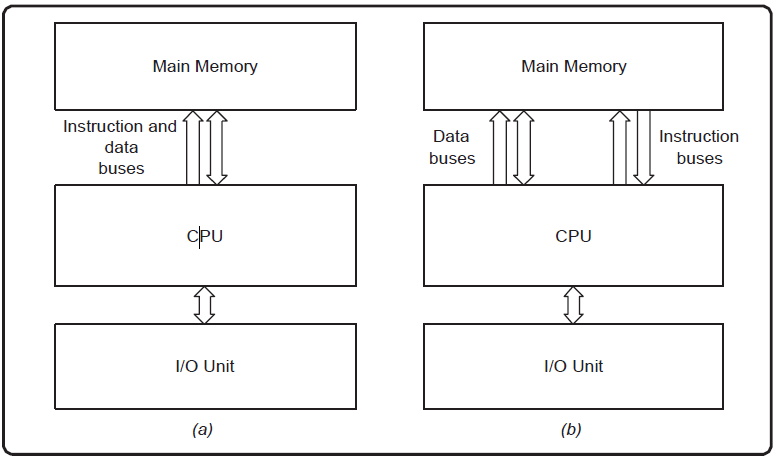

# Unit 1 Introduction to Computer System

## Introduction to Computers
A **computer** is an electronic device that processes data and performs tasks according to a set of instructions (program). It operates by accepting input, processing the data, and providing output, often storing the results for future use. Computers play an essential role in modern life, powering industries, communication, education, and daily activities.

### **Characteristics of Computers**
1. **Speed**  
   - Performs millions of instructions per second, making tasks faster compared to humans.  
2. **Accuracy**  
   - Delivers precise results as long as the input data and instructions are correct.  
3. **Automation**  
   - Once programmed, it can execute tasks automatically without human intervention.  
4. **Versatility**  
   - Can perform a wide range of tasks from calculations to simulations.  
5. **Storage Capacity**  
   - Can store vast amounts of data in different forms for quick retrieval.  
6. **Connectivity**  
   - Connects to other devices and networks for sharing data and resources.  
7. **Multitasking**  
   - Capable of running multiple programs or processes simultaneously.  
8. **Diligence**  
   - Unlike humans, computers do not suffer from fatigue or loss of concentration.  
9. **Communication**  
   - Facilitates data exchange between devices or over the internet.  
10. **Cost-Effectiveness**  
    - Reduces the need for manual labor, improving efficiency and productivity.

---

## Applications of Computers

**1. Business**
A computer has high speed of calculation, diligence, accuracy, reliability, or versatility which has made it an integrated part in all business organizations.
Computer is used in business organizations for −
Payroll calculations, Budgeting, Sales analysis, Financial forecasting, Managing employee database, Maintenance of stocks, etc.

**2. Banking**
Today, banking is almost totally dependent on computers.
Banks provide the following facilities −
- Online accounting facility, which includes checking current balance, making deposits and overdrafts, checking interest charges, shares, and trustee records.
- ATM machines which are completely automated are making it even easier for customers to deal with banks.

**3. Insurance**
Insurance companies are keeping all records up-to-date with the help of computers. Insurance companies, finance houses, and stock broking firms are widely using computers for their concerns.

Insurance companies are maintaining a database of all clients with information showing −
- Procedure to continue with policies
- Starting date of the policies
- Next due installment of a policy
- Maturity date
- Interests due
- Survival benefits
- Bonus

**4. Education**
The computer helps in providing a lot of facilities in the education system.

- The computer provides a tool in the education system known as CBE (Computer Based Education).
- CBE involves control, delivery, and evaluation of learning.
- Computer education is rapidly increasing the graph of number of computer students.
- There are a number of methods in which educational institutions can use a computer to educate the students.
- It is used to prepare a database about performance of a student and analysis is carried out on this basis.

**5. Marketing**
In marketing, uses of the computer are following −

- Advertising − With computers, advertising professionals create art and graphics, write and revise copy, and print and disseminate ads with the goal of selling more products.
- Home Shopping − Home shopping has been made possible through the use of computerized catalogues that provide access to product information and permit direct entry of orders to be filled by the customers.

**6. Healthcare**
Computers have become an important part in hospitals, labs, and dispensaries. They are being used in hospitals to keep the record of patients and medicines. It is also used in scanning and diagnosing different diseases. ECG, EEG, ultrasounds and CT scans, etc. are also done by computerized machines.

Following are some major fields of health care in which computers are used.
- Diagnostic System − Computers are used to collect data and identify the cause of illness.
- Lab-diagnostic System − All tests can be done and the reports are prepared by computer.
- Patient Monitoring System − These are used to check the patient's signs for abnormality such as in Cardiac Arrest, ECG, etc.
- Pharma Information System − Computer is used to check drug labels, expiry dates, harmful side effects, etc.
- Surgery − Nowadays, computers are also used in performing surgery.

**7. Engineering Design**
Computers are widely used for Engineering purpose.
One of the major areas is CAD (Computer Aided Design) that provides creation and modification of images. Some of the fields are −

- Structural Engineering − Requires stress and strain analysis for design of ships, buildings, budgets, air planes, etc.
- Industrial Engineering − Computers deal with design, implementation, and improvement of integrated systems of people, materials, and equipment.
- Architectural Engineering − Computers help in planning towns, designing buildings, determining a range of buildings on a site using both 2D and 3D drawings.

**8. Military**
Computers are largely used in defence. Modern tanks, missiles, weapons, etc. Military also employs computerized control systems. Some military areas where a computer has been used are −

- Missile Control
- Military Communication
- Military Operation and Planning
- Smart Weapons

**9. Communication**
Communication is a way to convey a message, an idea, a picture, or speech that is received and understood clearly and correctly by the person for whom it is meant. Some main areas in this category are −
- E-mail
- Chatting
- Usenet
- FTP
- Telnet
- Video-conferencing

**10 .Government**
Computers play an important role in government services. Some major fields in this category are −

- Budgets
- Sales tax department
- Income tax department
- Computation of male/female ratio
- Computerization of voters lists
- Computerization of PAN card
- Weather forecasting

## Classification of Computer
The classification of computers can be based on various criteria such as size, purpose, and functionality. 

### 1. **Based on Size and Performance**
- **Supercomputers**
A supercomputer is a special type of computer that is more powerful and capable of high-performance computing. It is specifically designed to compute complex and intensive tasks that regular computers cannot do efficiently.
Supercomputers can vary in size, from small clusters of computers to massive installations. A supercomputer may contain 10, 100, 1000, or more computers that all work together.
Supercomputers are most widely used in scientific research, data analysis, weather forecasting, scientific simulations, graphics, fluid dynamic calculations, nuclear energy research, electronic design, and the analysis of geological data. 
	 - Most powerful and fastest.
	 - Used for complex computations like weather forecasting, simulations, and research.
	 - Example: IBM Summit, Fugaku.
	 
- **Mainframe Computers**
The mainframe is very large and is an expensive computer capable of supporting hundreds or even thousands of users simultaneously. The mainframe executes many programmes concurrently and supports simultaneous execution of programmes.
Mainframe computers can vary in size; their size generally depends on their specifications and the specific model being considered. Mainframe computers are most widely used in finance, government, healthcare, and more.
	 - High-performance systems used in large organizations for bulk data processing.
	 - Supports multiple users and applications simultaneously.
	 - Example: IBM Z Series.
		 
- **Minicomputers (Mid-Range Computers)**
A minicomputer is a type of computer that is smaller in size than large computers. It possesses all the capabilities of a large computer. Hence, it is a midsize multi-processing system capable of supporting up to 250 users simultaneously.
Its size falls between mainframes and microcomputers. It is larger than mainframe computers and smaller than microcomputers. Minicomputers are most widely used in scientific computations, engineering, business transaction processing, file handling, and database management.
	 - Smaller than mainframes but capable of handling multiple users.
	 - Used in manufacturing and process control.
	 
- **Microcomputers (Personal Computers)**
Microcomputers, also known as personal computers (PCs), are a type of computer designed for individual use. They are distinguished by their compact dimensions, small size, processing power, compatibility, internet connectivity, portability, low price, and versatility. In the 1970s and 1980s, microcomputers gained popularity and became more popular in the modern computing era.
Microcomputers are small in size. These are portable. Microcomputers are most widely used in education and learning, entertainment and media, innovation and creativity, research and science, healthcare and medicine, home automation, remote work, and e-commerce and online shopping.
	 - Designed for individual use.
	 - Examples: Desktop PCs, Laptops, Tablets, Smartphones.
		 
   - **Workstations**
     - High-performance computers for technical or scientific applications.
     - Equipped with advanced graphics capabilities.
     - Used by engineers, architects, and designers.

---

### 2. **Based on Purpose**
 - **General-Purpose Computers**
A computer that is designed to perform a wide range of tasks and functions is called A General Purpose Computer (GPC). A GPC is versatile and can be used for various purposes by running different software and applications
 
Some of the following popular GPCs are as −
**Turing Completeness** − A GPC can simulate any algorithm or computation that can be explored algorithmically.
**Programmability** − GPCs can run different applications.
**General-Purpose Operating System** − GPCs like Windows, macOS, or Linux that provide an interactive user interface and manage hardware resources, enabling the execution of various application programmes.
**Input and Output Capabilities** − GPCs have input and output devices (keyboard, mouse, monitor, etc.) that permit users to interact with the system and receive feedback.

   - Designed for everyday tasks like browsing, word processing, and gaming.
   - Examples: Laptops, Desktops.
	 
- **Special-Purpose Computers**
A computer that is designed and optimised for a specific task or set of tasks is called a special purpose computer (SPC). SPCs are designed to excel at a single or limited set of functions, frequently with a high degree of efficiency, speed, and accuracy.

Some of the following popular SPCs are:
**Embedded Systems** − These systems are integrated with devices to control specific functions. For example, a car's engine control unit and microwave ovens
**Digital Signal Processors** − These are commonly used in applications like audio processing, image compression, and telecommunications.
**Automated Teller Machines** − ATMs are special-purpose computers designed specifically for banking transactions and interactions with customers.
**Medical Equipment** − Machines like MRI and CT scanners are specialised computers used for capturing and processing medical images.
**Spacecraft Computers** − Computers used in spacecraft have to operate in extreme conditions and are optimised for the demands of space missions.

   - Built for specific tasks such as controlling a machine or managing a system.
   - Examples: ATMs, traffic light controllers, medical devices.

---

### 3. **Based on Functionality**
 - **Analog Computers**
A computer that uses physical means like mechanical or hydraulic components to do the computation rather than electronic circuits is called an analogue computer. These computers work with continuous data and can manage physical quantities efficiently. They are particularly good at solving differential equations and simulating dynamic systems.
An analog computer performs arithmetic operations based on measurable quantities, such as mechanical movement or the rotation of gears. In analogue computers, data is processed as continuous signals for its operation, whereas in digital computers, data is transmitted as discrete signals (or discontinuous signals).
     - Works with continuous data.
     - Used in scientific and engineering applications.
     - Example: Slide rules, mechanical integrators.
		 
 - **Digital Computers**
 A digital computer is a type of computer that represents and processes data using discrete, distinct values.
 In digital computers, data is processed using binary numbers 0 and 1. These computers are designed to perform arithmetic calculations and complex data processing and manipulation. The main components of a digital computer are input, processing, and output.
     - Works with binary data (0s and 1s).
     - Most common type of computer today.
		 
- **Hybrid Computers**
A hybrid computer is a type of computer system that integrates the features and capabilities of both analogue and digital computers. This integration allows the hybrid computer to perform various tasks efficiently by leveraging the strengths of both digital and analog technologies
Analog components in a hybrid computer can process real-world data like voltage, current, temperature, pressure, etc. using analogue circuits and components
Digital computers work with discrete data and are based on binary numbers (0s and 1s). Digital components in a hybrid computer provide the computational power to perform complex calculations and control the overall operation of the system.
     - Combines features of both analog and digital computers.
     - Used in specialized applications like medical imaging systems.

---

### 4. **Based on Generations**
 **First Generation (1940s-1950s):** Vacuum tube-based.
	- The timeline for the first generation computers was 1940 to 1956.
	- The first generation computers were developed using vacuum tube or thermionic valve machine.
	- Punched cards and paper tape were used as input/output.
	- Magnetic drums and magnetic tapes were used as a memory device to save the data
	- These computers were consuming lot of electricity because of vacuum tubes and other electronic devices and generate lot of heat.
	- These were bigger in size and more expensive.
	- These computers were worked on binary-coded concept (i.e., language of 0-1).
	- Examples − ENIAC, EDVAC, etc. 

**Second Generation (1950s-1960s):** Transistor-based.
	- The timeline for the second generation computers was 1956 to 1963.
	- Transistors were used to develop.
	- In comparison to the first generation, second generation computers were small in size.
	- Punched cards and magnetic tape were used for input /output.
	- Electricity consumption was low and produces less heat.
	- Magnetic core memory was used.
	- Fast computing and were used in business, scientific research, and government applications.
	- Examples − UNIVAC, IBM 1401, IBM 7090.

**Third Generation (1960s-1970s):** Integrated Circuit-based.
	- The timeline for the third generation computers was 1963 to 1971.
	- Integrated Circuit (IC) was used to develop.
	- In comparison to the second generation, third generation computers were small in size.
	- Magnetic tape, keyboard, monitor, printer devices were used as input and output.
	- Computation power was higher as compare to second generation computers.
	- The third generation computer consumed less power and also generated less heat.
	- The maintenance cost of the computers in the third generation was also low as these were consuming less power and generated less heat.
	- These were most widely used in commercial purposes.
	- Examples − UNIVAC, IBM 360, IBM 370.

**Fourth Generation (1970s-Present):** Microprocessor-based.
	- The timeline for the fourth generation computers was 1972 to 2010.
	- Microprocessor technology was used to develop.
	- These were surprising in terms of size and computing power.
	- Portable computers.
	- Very less power consuming and affordable.
	- Semiconductor memory such as RAM, ROM were used which makes computation faster.
	- Keyboard, pointing devices, optical scanning, monitor, printer devices were used for input and output.
	- It became available for the common people as well.
	- Examples − IBM PC, STAR 1000, Apple.

**Fifth Generation (Present-Future):** Focus on Artificial Intelligence and Quantum Computing.
	- The timeline for the fifth generation computers is form 2010 to till date.
	- These computers are based on artificial intelligence, Ultra Large-Scale Integration (ULSI), Quantum computation, Nanotechnology, Parallel processing technology.
	- Very fast and multiple tasks could be performed simultaneously.
	- These are smaller in size as compare to fourth generation computers.
	- Consumes very low power.
	- Keyboard, monitor, mouse, touchscreen, scanner, printer are used as an input output devices.
	- Examples − Laptops, tablets, smartphones are most popular examples of fifth generation computers.

---

## **Mobile Computing**
**Mobile computing** refers to the ability to use computing devices, such as smartphones, laptops, tablets, and other portable gadgets, while being mobile or on the move. It involves the use of wireless technologies to provide seamless access to applications, data, and communication.

### **Key Components of Mobile Computing**

1. **Mobile Hardware**
   - Portable devices like:
     - Smartphones
     - Tablets
     - Laptops
     - Wearable devices (e.g., smartwatches, fitness trackers)
   - Equipped with processors, memory, display, input methods, and wireless communication interfaces.

2. **Mobile Software**
   - Operating systems (e.g., Android, iOS, Windows Mobile).
   - Applications designed for mobility and compatibility with mobile hardware.

3. **Mobile Communication**
   - Wireless technologies that facilitate connectivity and data exchange:
     - Wi-Fi
     - Cellular Networks (e.g., 4G, 5G)
     - Bluetooth
     - NFC (Near Field Communication)

### **Advantages of Mobile Computing**

1. **Portability**
   - Enables users to access resources from anywhere.
2. **Connectivity**
   - Continuous and reliable communication through wireless networks.
3. **Flexibility**
   - Supports remote work and on-the-go operations.
4. **Efficiency**
   - Allows real-time communication, access to cloud-based services, and mobile applications.

### **Applications of Mobile Computing**

1. **Communication**
   - Instant messaging, video calls, social media platforms.
2. **Commerce**
   - Mobile banking, online shopping, digital payments (e.g., Apple Pay, Google Pay).
3. **Healthcare**
   - Remote patient monitoring, fitness apps, telemedicine.
4. **Education**
   - E-learning platforms, virtual classrooms, and remote access to educational resources.
5. **Navigation**
   - GPS-based navigation, route planning, and real-time traffic updates.
6. **Entertainment**
   - Streaming services, gaming, and social media.

---

### **Challenges in Mobile Computing**

1. **Security Concerns**
   - Data theft and privacy issues in wireless communications.
2. **Battery Life**
   - Limited battery capacity of mobile devices.
3. **Network Reliability**
   - Dependence on stable wireless networks.
4. **Processing Power**
   - Limited computing power compared to traditional desktops or servers.

---

### **Future of Mobile Computing**

- **5G Technology**
  - Faster and more reliable connectivity for advanced applications.
- **IoT Integration**
  - Enhanced interaction with smart devices and sensors.
- **Edge Computing**
  - Localized data processing for reduced latency.
- **Augmented and Virtual Reality**
  - Immersive experiences for entertainment, training, and more.

## Anatomy of Digital Computer 
The **anatomy of a digital computer** refers to its fundamental structure and the core components that work together to perform computational tasks. A digital computer processes data in binary form (0s and 1s) using hardware and software systems.
Computer systems consist of three components: Central Processing Unit, Input devices and Output devices. Input devices provide data to the processor (processing unit), which processes it and generates useful information that’s displayed to the user through output devices. Output devices are used to show the processed data to the user on computer screen or in print form.

---

### **1. Central Processing Unit (CPU)**  
The Central Processing Unit (CPU) is also known as "the brain of computer". It controls operation of all components of a computer. It is responsible for executing instructions.

A CPU itself has three components which are as follows −
- Control Unit (CU)
- ALU(Arithmetic Logic Unit)
- Memory or Storage Unit

#### a) **Arithmetic Logic Unit (ALU)**  
The Arithmetic Logic Unit (ALU) is a component that has been extensively optimised and engineered to do multiple tasks concurrently. It is commonly built to execute operations speedily. It works in conjunction with other CPU components, such as registers, memory, and control units, to execute complex instructions.

**Functions of an ALU**
- Arithmetic Operations − The ALU can perform basic arithmetic operations such as addition, subtraction, multiplication, and division.
- Logic Operations − The ALU can also perform logical operations like AND, OR, NOT, XOR, and bit-shifting operations.
- Comparison − The ALU can compare two binary values and determine whether they are equal, greater than, or less than each other. This function is most widely used in programming and sorting algorithms.

#### b) **Control Unit (CU)**  
As its name implies, a control unit acts as the "brain" of the CPU. It executes instructions and manages the flow of data inside the CPU to perform the tasks specified by a computer program. It plays a pivotal role in the fetch-decode-execute cycle, which is a fundamental process by which a CPU runs program instructions.
**Functions of Control Unit**
- Instruction Fetch − To run and execute a program; a CU fetches instructions from RAM (Random Access Memory).
- Instruction Decoding − It decodes the fetched instructions to determine the operation to be performed.
- Instruction Execution − A CU executes the instructions by sending control signals to the appropriate functional units within the CPU, such as the ALU for arithmetic and logical operations
- Control Flow Management − The Control Unit is responsible for overseeing the control flow of the programme. It accomplishes this by updating the programme counter, which enables the CPU to go to the subsequent instruction in the sequence based on conditional statements or jumps.
- Exception Handling − The system effectively manages exceptions and interruptions, including hardware failures, system calls, and external events, by appropriately diverting the control flow of the central processing unit (CPU) to the planned procedure for managing such exceptions.
- Pipeline Control (in pipelined CPUs) − The modern CPU’s are available with pipeline designs; a CU controls the steps of the pipeline and makes sure that instructions are processed quickly and safely.
- Synchronization − In the context of multi-core processors, a CU plays a crucial role in facilitating the coordination of instruction execution across several cores, hence guaranteeing the appropriate synchronisation and maintenance of data consistency.

#### c) **Memory Unit**  
A memory or storage unit is a hardware component which is used to store the data and instructions and retrieve it whenever is required. Majorly computer memory has categorised as temporary (RAM) and permanent memory (secondary memory). RAM is used for short-term, fast data access and essential for active program execution. On the other hand, storage or secondary memory provides permanent data storage. Hence, memory and storage units both are critical components of a computer system.

### **Working of a Digital Computer**  
1. **Input:** User provides data via input devices.  
2. **Processing:**  
   - CPU fetches, decodes, and executes instructions.  
   - ALU performs calculations or logic operations.  
3. **Storage:** Data is stored temporarily in RAM or permanently in secondary storage.  
4. **Output:** Processed data is delivered to output devices for user interpretation.  

This modular structure ensures flexibility, efficiency, and scalability in digital computers.

## **Computer Architecture**
Computer architecture refers to the end-to-end structure of a computer system that determines how its components interact with each other in helping in processing data, often avoiding any reference to the actual technical implementation. It defines what is seen on the machine interface, which is targeted by programming languages and their compilers. 

Complex Instruction Set Computer (CISC) and Reduced Instruction Set Computer (RISC) are the two major approaches to processor architecture. 

CISC processors have a single processing unit, external memory, and a small register set with hundreds of different instructions. These processors have a single instruction to perform a task, and have the advantage of making the job of the programmer easier, as fewer lines of code are needed to get the job done. This approach uses less memory, but can take longer to complete instructions. 

The RISC architecture was the result of a rethink, which has led to the development of high-performance processors. The hardware is kept as simple and fast as possible, and complex instructions can be performed with simpler instructions

| Feature                | RISC                              | CISC                              |
|------------------------|------------------------------------|------------------------------------|
| **Instruction Set**    | Fewer, simpler instructions       | Many complex instructions         |
| **Execution Time**     | Single-cycle for most instructions| Multiple cycles for some instructions |
| **Code Size**          | Larger (requires more instructions)| Smaller (fewer instructions needed)|
| **Hardware**           | Simple, more registers            | Complex, fewer registers          |
| **Pipelining**         | Easier to implement               | More difficult to implement       |
| **Energy Efficiency**  | More energy-efficient             | Less energy-efficient             |
| **Examples**           | ARM, MIPS                         | x86, Intel 8086                   |

Examples of Computer Architecture: (a) Von Neumann Architecture and (b) Harvard Architecture 

## The von Neumann architecture
Mathematician John von Neumann and his colleagues proposed the von Neumann architecture in 1945, which stated that a computer consists of 5 major components
- A processor with connected registers
- A control unit responsible for decoding and executing instructions. 
- Memory capable of storing information as well as instructions and communicating via buses
- Additional or external storage
- Input as well as output device mechanisms

The central computation concept of this architecture is that instructions and data are both loaded into the same memory unit, which is the main memory of the computer and consists of a set of addressable locations. The processor can then access the instructions and data required for the execution of a computer program using dedicated connections called buses – an address bus which is used to identify the addressed location and a data bus which is used to transfer the contents to and from a location.

### Harvard architecture
Another popular computer architecture, though less so than the von Neumann architecture, is Harvard architecture. 

The Harvard architecture keeps instructions and data in separate memories, and the processor accesses these memories using separate buses. The processor is connected to the ‘instructions memory’ using a dedicated set of address and data buses, and is connected to the ‘data memory’ using a different set of address and data buses. 

This architecture is used extensively in embedded computing systems such as digital signal processing (DSP) systems, and many microcontroller devices use a Harvard-like architecture. 

## Memory and Its Classification
Computer memory is any physical device, used to store data, information or instruction temporarily or permanently.

### 1. Primary or Main Memory
It communicates directly within the CPU, Auxiliary memory and the Cache memory. Main memory is used to kept programs or data when the processor is active to use them. To execute a program, the processor first loads it from secondary memory into main memory, and then the processor starts execution. Accessing or executing of data from primary memory is faster because it has a cache or register memory that provides faster response, and it is located closer to the CPU. The primary memory is volatile, which means the data in memory can be lost if it is not saved when a power failure occurs. It is costlier than secondary memory, and the main memory capacity is limited as compared to secondary memory.

The primary memory is further divided into two parts:
- RAM (Random Access Memory)
- ROM (Read Only Memory)

#### Random Access Memory (RAM)
It is the internal memory of the CPU for storing data, program, and program result. It is a read/write memory which stores data until the computer is working. As soon as the computer is switched off, data is erased. Therefore, RAM is a volatile memory.

There are two types of RAM:
- **SRAM**
SRAM stands for Static Random Access Memory. Each memory cell of SRAM is made up of a flip-flop.  Since, capacitors are not used there is no data leakage. So SRAM need not be refreshed regularly.

- **DRAM**
DRAM stands for Dynamic Random Access Memory. Each memory cell of DRAM is made up of one transistor and one capacitor. In DRAM, the data and information is stored in the form of an electric charged on the capacitor. Since capacitor loses its data (charge), thus DRAM must be continually refreshed several hundred times per second to maintain the data.

DRAM is a small sized and less expensive type of RAM. For this reason, it is used as RAM in most computer systems. However, DRAM is relatively slower and has a short data life than SRAM.

**SRAM vs DRAM**
| Feature                          | SRAM (Static RAM)                 | DRAM (Dynamic RAM)                 |
|----------------------------------|------------------------------------|------------------------------------|
| **Full Form**                    | Static Random-Access Memory        | Dynamic Random-Access Memory       |
| **Access Time**                  | Slow                              | High                               |
| **Storage Mechanism**            | Uses flip-flops for each bit       | Uses capacitors for each bit       |
| **Refreshing**                   | No periodic refreshing needed      | Requires periodic refreshing       |
| **Usage**                        | Cache memory                      | Main memory                        |
| **Cost**                         | Expensive                         | Less expensive                     |
| **Structure**                    | Complex                           | Simple                             |
| **Power Consumption**            | Low                               | More                               |

#### Read-Only Memory (ROM)
ROM is a memory device or storage medium that is used to permanently store information inside a chip. It is a read-only memory that can only read stored information, data or programs, but we cannot write or modify anything. A ROM contains some important instructions or program data that are required to start or boot a computer. It is a non-volatile memory; 

There are five types of Read Only Memory:
**1. MROM (Masked Read Only Memory):**
MROM is the oldest type of read-only memory whose program or data is pre-configured by the integrated circuit manufacture at the time of manufacturing. Therefore, a program or instruction stored within the MROM chip cannot be changed by the user.

**2. PROM (Programmable Read Only Memory):**
It is a type of digital read-only memory, in which the user can write any type of information or program only once. It means it is the empty PROM chip in which the user can write the desired content or program only once using the special PROM programmer or PROM burner device; after that, the data or instruction cannot be changed or erased.

**3. EPROM (Erasable and Programmable Read Only Memory):**
It is the type of read only memory in which stored data can be erased and re-programmed only once in the EPROM memory. It is a non-volatile memory chip that holds data when there is no power supply and can also store data for a minimum of 10 to 20 years. In EPROM, if we want to erase any stored data and re-programmed it, first, we need to pass the ultraviolet light for 40 minutes to erase the data; after that, the data is re-created in EPROM.

**4. EEPROM (Electrically Erasable and Programmable Read Only Memory):**
The EEROM is an electrically erasable and programmable read only memory used to erase stored data using a high voltage electrical charge and re-programmed it. It is also a non-volatile memory whose data cannot be erased or lost; even the power is turned off. In EEPROM, the stored data can be erased and reprogrammed up to 10 thousand times, and the data erase one byte at a time.

**5. Flash ROM:**
Flash memory is a non-volatile storage memory chip that can be written or programmed in small units called Block or Sector. Flash Memory is an EEPROM form of computer memory, and the contents or data cannot be lost when the power source is turned off. It is also used to transfer data between the computer and digital devices.

**RAM vs ROM**
| Feature                          | RAM (Random-Access Memory)        | ROM (Read-Only Memory)            |
|----------------------------------|------------------------------------|-----------------------------------|
| **Full Form**                    | Random-Access Memory              | Read-Only Memory                 |
| **Operations**                   | Read and write operations         | Only read operation              |
| **Volatility**                   | Data is lost when power is off (volatile) | Data is retained when power is off (non-volatile) |
| **Speed and Cost**               | Faster and more expensive         | Slower and less expensive         |
| **Data Refresh**                 | Requires refreshing               | Does not require refreshing       |
| **Chip Size**                    | Bigger than ROM for the same data size | Smaller than RAM for the same data size |
| **Types**                        | DRAM, SRAM                        | MROM, PROM, EPROM, EEPROM         |

### Secondary Memory
Secondary memory is a permanent storage space to hold a large amount of data. Secondary memory is also known as external memory that representing the various storage media (hard drives, USB, CDs, flash drives and DVDs) on which the computer data and program can be saved on a long term basis. However, it is cheaper and slower than the main memory. Unlike primary memory, secondary memory cannot be accessed directly by the CPU. Instead of that, secondary memory data is first loaded into the RAM (Random Access Memory) and then sent to the processor to read and update the data. 

##### Types of Secondary Memory

**Hard Disk**
A hard disk is a computer's permanent storage device. It is a non-volatile disk that permanently stores data, programs, and files, and cannot lose store data when the computer's power source is switched off. Typically, it is located internally on computer's motherboard that stores and retrieves data using one or more rigid fast rotating disk platters inside an air-sealed casing. It is a large storage device, found on every computer or laptop for permanently storing installed software, music, text documentation, videos, operating system, and data until the user did not delete.

**Floppy Disk**
A floppy disk is a secondary storage system that consisting of thin, flexible magnetic coating disks for holding electronic data such as computer files. It is also known as Floppy Diskette that comes in three sizes like 8 inches, 5.5 inches and 3.5 inches. The stored data of a floppy disk can be accessed through the floppy disk drive. Furthermore, it is the only way through a new program installed on a computer or backup of the information. However, it is the oldest type of portable storage device, which can store data up to 1.44 MB. Since most programs were larger, that required multiple floppy diskettes to store large amounts of data. Therefore, it is not used due to very low memory storage.

**CD (Compact Disc)**
A CD is an optical disk storage device, stands for Compact Disc. It is a storage device used to store various data types like audio, videos, files, OS, Back-Up file, and any other information useful to a computer. The CD has a width of 1.2 mm and 12 cm in height, which can store approximately 783 MB of data size. It uses laser light to read and write data from the CDs.

Types of CDs
   1. CD-ROM (Compact Disc Read Only Memory): It is mainly used for bulk size mass like audio CDs, software and computer games at the time of manufacture. Users can only read data, text, music, videos from the disc, but they cannot modify or burnt it.
   2. CD-R (Compact Disc Recordable): The type of Compact Disc used to write once by the user; after that, it cannot be modified or erased.
   3. CD-RW (Compact Disc Rewritable): It is a rewritable CD disc, often used to write or delete the stored data.
   
**DVD Drive/Disc**
DVD is an optical disc storage device, stands for Digital Video Display or Digital Versatile Disc. It has the same size as a CD but can store a larger amount of data than a compact disc. It was developed in 1995 by Sony, Panasonic, Toshiba and Philips four electronics companies. DVD drives are divided into three types, such as DVD ROM (Read Only Memory), DVD R (Recordable) and DVD RW (Rewritable or Erasable). It can store multiple data formats like audio, videos, images, software, operating system, etc. The storing capacity of data in DVD is 4.7 GB to 17 GB.

**Blu Ray Disc (BD)**
Blu Ray is an Optical disc storage device used to store a large amount of data or high definition of video recording and playing other media files. It uses laser technology to read the stored data of the Blu-ray Disk. It can store more data at a greater density as compared to CD/ DVD. For example, compact discs allow us to store 700 MB of data, and in DVDs, it provides up to 8 GB of storage capacity, while Blu-ray Discs provide 28 GB of space to store data.

**Pen Drive**
A pen drive is a portable device used to permanently store data and is also known as a USB flash drive. It is commonly used to store and transfer the data connected to a computer using a USB port. It does not have any moveable part to store the data; it uses an integrated circuit chip that stores the data. It allows the users to store and transfer data like audio, videos, images, etc. from one computer to any USB pen drive. The storing capacity of pen drives from 64 MB to 128 GB or more.

#### CPU Cache Memory Explained
DRAM is memory that uses capacitors to store data and these capacitors have to constantly and dynamically be refreshed often with electricity in order for them to store data. Because SRAM doesn't have to be constantly refreshed, it is a lot  faster than DRAM and it's also very expensive. 
The CPU cache is the CPU's internal memory.  And its job is to store copies of data and instructions from RAM that's waiting to be used by the CPU. Basically CPU cache holds common data that it thinks the CPU is going to access over and over again because when the CPU needs to access certain data, it always checks the faster cache memory first to see if a data it needs is there. And if it's not,  then the CPU would have to go back to the slower primary memory or RAM to get the data it needs. So  that's why cache memory is so important, because if the CPU can access what it needs on the faster  cache, then the faster the computer will perform. The whole idea behind cache is to  make the computer run faster at a cheaper price. 

Now a computer can run without the CPU  cache, but it would be a lot slower because even though RAM is becoming faster,  it still can't feed the data to the CPU fast enough because CPUs have gotten so fast, that  a lot of times the CPU is waiting around doing nothing while it waits for more data, and  this creates a bottleneck. Hence CPU cache can  act like a middleman between the CPU and RAM to assist in feeding the CPU the data it needs a lot faster which reduces bottlenecks. 

**CPU Cache Levels** 
CPU cache comes in three different  levels. 
Level  1 cache(primary cache) is located on the processor itself. So it runs as the same speed as the processor. So  it's very fast and is the fastest cache on the computer. 
Level 2 cache(external cache) is used to catch recent data accesses from the  processor that were not caught by the level 1 cache. If the CPU can't find  that data it needs in the level 1 cache, it then searches the level 2 cache for the data. And if  the CPU can't find the data in the level 2 cache, then it searches the last level of cache which  is level 3. And level 3 cache is used to catch recent data accesses that were not caught  by the level 2 cache. And finally if level 3 doesn't have the data, then the CPU has to go  back to the slower RAM to find the data it needs. 

**CPU Cache Locations** 
Now in earlier computers, level 2 cache was  located on a separate chip on the motherboard but in modern CPUs, it would be located on  the processor. Level 2 cache is larger than level 1 cache but it's not as fast as level  1 cache. And level 3 cache is also located on the processor. Level 3 is larger than  level 2 but it's not as fast as level 2 cache. Level 3 is often referred to as **shared cache** because its memory is shared between all the cores on the CPU, whereas level 1 and level  2 cache are dedicated to their own CPU core.

### Cache Memory
It is a small-sized chip-based computer memory that lies between the CPU and the main memory. It is a faster, high performance and temporary memory to enhance the performance of the CPU. It stores all the data and instructions that are often used by computer CPUs. It also reduces the access time of data from the main memory. It is faster than the main memory, and sometimes, it is also called CPU memory because it is very close to the CPU chip. The following are the levels of cache memory.

- L1 Cache: The L1 cache is also known as the onboard, internal, or primary cache. It is built with the help of the CPU. Its speed is very high, and the size of the L1 cache varies from 8 KB to 128 KB.
- L2 Cache: It is also known as external or secondary cache, which requires fast access time to store temporary data. It is built into a separate chip in a motherboard, not built into the CPU like the L1 level. The size of the L2 cache may be 128 KB to 1 MB.
- L3 Cache: L3 cache levels are generally used with high performance and capacity of the computer. It is built into a motherboard. Its speed is very slow, and the maximum size up to 8 MB.

**Advantages of Cache Memory**
- Cache memory is the faster memory as compared to the main memory(DRAM).
- It stores all data and instructions that are repeatedly used by the CPU for improving the performance of a computer or required in the near future
- Slower compared to register
- Cannot be accessed directly by programmers 

### Register Memory
The register memory is a temporary storage area for storing and transferring the data and the instructions to a computer. It is the smallest and fastest memory of a computer. It is a part of computer memory located in the CPU as the form of registers. The register memory is 16, 32 and 64 bits in size. It temporarily stores data instructions and the address of the memory that is repeatedly used to provide faster response to the CPU.

- It is located on-chip i.e. CPU. 
- It has quick access time. 
- Stores data that is required immediately for current operation 
- Assembly language instructions for accessing them 

Examples of Registers: 
Program Counter:  Holds the address of next instruction 
Status Registers: Has flags that are updated  based on the outcome of the computation 
General Purpose: used for storing memory addresses  or variables of program .p

**Primary vs Secondary Memory**
| Primary Memory                                    | Secondary Memory                                 |
|--------------------------------------------------|-------------------------------------------------|
| It is also known as temporary memory.            | It is also known as a permanent memory.         |
| Data can be accessed directly by the processor or CPU. | Data cannot be accessed directly by the I/O processor or CPU. |
| Stored data can be a volatile or non-volatile memory. | The nature of secondary memory is always non-volatile. |
| It is more costly than secondary memory.         | It is less costly than primary memory.          |
| It is a faster memory.                           | It is a slower memory.                          |
| It has limited storage capacity.                 | It has a large storage capacity.                |
| It requires power to retain the data in primary memory. | It does not require power to retain the data in secondary memory. |
| Examples of primary memory are RAM, ROM, Registers, EPROM, PROM and cache memory. | Examples of secondary memory are CD, DVD, HDD, magnetic tapes, flash disks, pen drive, etc. |

#### **Memory Hierarchy:**
- **Registers** (Fastest, smallest capacity) → **Cache** → **RAM** → **Secondary Storage** (Slowest, largest capacity).

---

## Input Devices
Input devices are the devices that are used to send signals to the computer for performing tasks. The receiver at the end is the CPU (Central Processing Unit), which works to send signals to the output devices. Some of the Input devices are:
Keyboard, Mouse, Joystick, Trackball , Lightpen , Scanner, Bar Code Reader, Web Camera, Microphone., OMR, OCR, MICR, etc. 

- Optical Mark Reader(OMR) : It is a device that is generally used in educational institutions to check the answers to objective exams. It recognizes the marks present by pencil and pen.
- Optical Character Reader(OCR):  It is a device that reads printed text. OCR optically scans the text, character by character turns it into a machine-readable code, and saves it to the system memory.
- Magnetic Ink Card Reader(MICR): It is a device that is generally used in banks to deal with the cheques given to the bank by the customer. It helps in reading the magnetic ink present in the code number and cheque number

## Output Devices
Output Devices are the devices that show us the result after giving the input to a computer system. Output can be of many different forms like image, graphic audio, video, etc.  Examples: 

1. **Monitor:** Displays visual output.
2. **Printer:** Produces hard copies of digital documents.
3. **Speakers:** Outputs audio.
4. **Headphones:** Personal audio output.
5. **Projector:** Projects visual output onto larger screens.
6. **Haptic Devices:** Provide tactile feedback (e.g., vibration).

### Impact Printer
Characters are printed on the ribbon, which is subsequently crushed against the paper, in impact printers. Impact printers make a picture by utilizing some tool to press an inked ribbon on the paper, presenting the ink be kept on the page in the shape accordingly. These printers produce so much noise, but people are still using them because of the quality and capability to work with multipart structures. Ball printers, Dot-matrix, Daisy wheel printers, Line printers, Drum printers, and Chain printers are some examples of Impact Printers.

The following are the characteristics of impact printers:
- Quite noisy
- Because of its low cost, it is ideal for large-scale printing.
- To create an image, there is physical contact with the paper.

**Character Printers**
Character Printer has the capability to print only one character at a time. It is of two types.
   1. Dot Matrix Printer
   2. Daisy Wheel

**Line Printers**
Line Printers are printers that have the capability to print one line at a time. It is of two types.
   1. Drum Printer
   2. Chain Printer

### Non-Impact Printers
Non-impact printers create pictures, characters, and figures without any uninterrupted contact between the printing device and the paper. Characters are printed without the need for a ribbon in non-impact printers. Because these printers print a full page at a time, they’re also known as Page Printers. The following are the characteristics of non-impact printers:
- They don’t make a lot of noise.
- Excellent quality

**Laser Printers**
Laser Printers use laser lights for producing dots which will produce characters on the page.
Laser printers are high-speed, green printing devices that make use of laser generation to supply crisp and precise text and graphics. They work via creating an electrostatic image on a photosensitive drum the usage of a laser beam, which draws toner debris. laser printers are widely utilized in offices and homes. They provide sharp prints, manage large volumes successfully, and are cost-green through the years. Laser printers are suitable for diverse record kinds, delivering expert-quality output with speed and accuracy.

**Inkjet Printers**
Inkjet printers are printers that use spray technology for printing papers. High-quality papers are produced in an Inkjet printer. They also do color printing. 
Inkjet Printers are used for domestic as well as small business uses due to the high quality prints they give out. With these printers, a hydraulic system is in use to spray a personified ink with precision over paper using microscopic nozzles which produces sharp and colourful images. Inkjet technology has a instead high-end ability and can help in the creation of simple yet colorful photos, strong text documents, as well as detailed graphics. The inkjet printers are preferred due to their ability of printing on different types of media materials that include time to pass similar tones and paper that is intended for photos or other particular stocks.

### Impact vs Non-Impact Printer
| **Parameters**           | **Impact Printer**                                                                                  | **Non-Impact Printer**                                                                                  |
|---------------------------|-----------------------------------------------------------------------------------------------------|---------------------------------------------------------------------------------------------------------|
| **Definition**            | Impact printers create pictures and figures by hitting a device such as a wheel or a print hammer against an inked ribbon. | Non-impact printers create figures and pictures without any connection between the printing device and the paper. |
| **Printing Execution or Mechanism** | In impact printers, printing is executed by hammering a character dye or metal pin.                                   | In non-impact printers, printing is executed by dropping ink on paper in any manner.                   |
| **Speed Of Printers**     | Impact printers are low in terms of speed.                                                         | Non-impact printers are comparatively fast in speed. They can print several pages in one minute.       |
| **Noise Of Printers**     | They produce high-level noise as they have many moving parts.                                       | They have a low level of noise.                                                                        |
| **Printing Process**      | Impact printers generally utilize hammers, pins, or wheels to hit against an inked ribbon to print on paper. | Non-impact printers use a spray of ink, laser, or heat and pressure to execute their printing operation. |
| **Print Quality**         | The print quality of impact printers is lower.                                                     | The print quality of non-impact printers is higher.                                                   |
| **Printing Ink**          | When print head strikes, then they prefer special inked ribbons to produce print on paper.         | They prefer cartridges or toner for printing on paper.                                                |
| **Technology**            | They utilize traditional printing technologies.                                                    | They utilize contemporary printing technologies.                                                      |
| **Value**                 | They are pretty affordable.                                                                        | They are quite expensive as compared to impact printers.                                              |
| **Paper Sheet Used**      | They prefer continuous paper sheets.                                                               | They prefer individual paper sheets.                                                                  |
| **Graphic Images**        | Except Dot matrix printers, no other impact printers can print graphics images.                    | Printing graphical illustrations are possible in non-impact printers.                                 |
| **Character Style**       | Except for the dot matrix, the character or figure style cannot be changed in the other impact printers. | It can print various types of figures from carrying                                                   |

## Interfaces
Interfaces are the connections that allow components of a computer system to communicate. Interfaces are tools and concepts that technology developers use as points of interaction between hardware and software components. They help all components within a system communicate with each other via an input-output system and detailed protocols while also allowing them to function independently.
Interfaces also help users interact with various types of devices through hardware devices like keyboards, mice and touch screens and software programs like operating systems or internet protocols.

### **Types of Interfaces:**
#### 1. Hardware Interfaces:
Hardware interfaces help various hardware devices connect and communicate with each other. Some common hardware interfaces in computing are:

- **USB (universal serial bus) interfaces:** These are serial interfaces that hardware developers use to connect various types of devices, including scanners, printers, digital cameras, external storage devices and keyboards. Their wide applicability makes them a very common type of hardware interface.
- **Serial interfaces:** They transmit data as single streams of items and act as communication interfaces between two digital systems, sending data as a series of voltage pulses over a single wire. They typically stream data one bit at a time, and professionals often use them to create small-scale points of connection, like linking a mouse to a computer.
- **Parallel interfaces:** They allow developers to send multiple bits of data across different command lines or channels. Using multiple wires makes them faster than serial interfaces, meaning they may be more useful for large-scale points of connection, like connecting a scanner or printer machine to a computer system.

#### 2. Software Interfaces:
Software interfaces, also called programming interfaces, are the languages that various software applications use to communicate with each other and with a hardware's internal system. They typically control a system's resources, such as its memory, storage space and CPU.
They can also give applications restricted access to these resources to better ensure a system's overall stability and functionality. Some common examples of software interfaces are:

- **Operating systems:** These are the software applications that manage computing devices' hardware and coordinate their resources, giving a program the right tools to function properly. They're usually optimized to run on specific devices, like desktop computers, mobile devices or machines that perform a single task, such as an ATM.
- **Simple Mail Transfer Protocol (SMTP) email:** This is a text-based and connection-oriented protocol for sending email messages from one account to another via the internet. It also allows multiple email clients to exchange information.
- **IP network protocols:** These are a set of rules that enable data to travel across a global network and arrive at the intended destination by dividing it into smaller and more manageable pieces, called packets. Each packet has IP information attached to it, and each network has an interface with a unique address that helps the packet reach its destination.
- **Software drivers:** They're software components that enable a computing device to communicate with its operating system. They do so by providing a programming interface that manages and controls lower-level interfaces and is typically specific to a certain type and model of hardware.

#### 3. User Interfaces:
User interfaces facilitate the interactions between humans and computing devices. They work by enabling the machine to provide information to the user, plus help them operate or control these systems efficiently. Some common types of user interfaces are:

- **Command-line interface:** This is a text-only interface that allows users to issue basic commands to a computer. It typically requires few system resources and may benefit experienced users who have some prior programming knowledge.
- **Graphical User Interface (GUI):** This system enables users to control computing devices using graphical icons and audio indicators. They're an alternative to text-only interfaces that may require some knowledge of a programming language, meaning they can allow non-technical users to operate complex devices effectively.
- **Menu-driven interface:** This type of user interface uses a series of screens, called menus, that help the user interact with devices. They show the user a specific screen in either a graphic or list format, then present choices that allow users to complete a goal or advance to a secondary menu with additional options.

